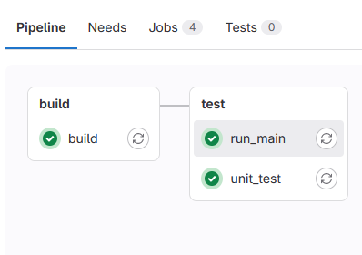
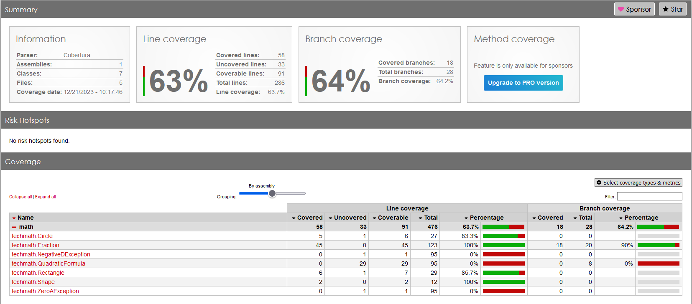

# H3PD_SW_Test

A repository with a small code sample used in the courses like Object Oriented Programming & Software Test at TECHCOLLEGE Aalborg


# Purpose

To show a practical usage of Unit Testing and Continuous Integration using Gitlab and C#


The source code contains three projects:

## math

A class lib containing the namespace **techmath** with a number of "simple" math related classes

* Fraction
* Shape
	* Rectangle
	* Circle
* QuadraticFormula

## tests

A XUnit test based project for unit testing of the **techmath** classes

## console_app

A sample console based application demonstrating the simple usages of the **techmath** classes


# How to

## Clean up and Build

```
dotnet clean
dotnet build
```

## Run the console app

```
dotnet run --project console_app
```

## Run unit tests (and collect coverage data)

```
dotnet test

dotnet test --collect:"XPlat Code Coverage"
```

## Make coverage report


```
reportgenerator -reports:"tests\TestResults\{guid}\coverage.cobertura.xml" -targetdir:"coveragereport" -reporttypes:Html
```

-reporttypes:TextSummary

# Continuous Integration

The continuous integration process is defined in **.gitlab-ci.yml**

It contains two stages:

* build
	- build the solution to check for compile errors
* test
	- run unit tests
	- run the sample main program

.


During the execution of the unit test the code coverage is collected. The results are shown in the following format. (as an Artifact)

.


# Feedback

Any Feedback is very welcome: pmad@techcollege.dk

